# RWAEstate

**Fractional ownership of real-world property, settled in stablecoins and enforced by compliance-gated token transfers.**

Each building becomes an ERC-20. Investors buy fractions with USDC, rent is distributed on-chain, and positions stay tradable on a permissioned secondary market. Live on Sepolia.

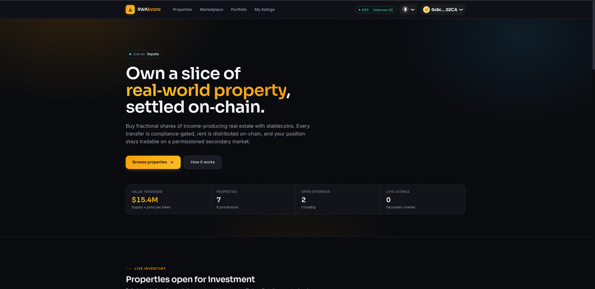

---

## What it does

| | |
|---|---|
| **Tokenise** | One ERC-20 per property, minted against an on-chain registry record backed by IPFS metadata |
| **Gate** | Every transfer checks a KYC registry + per-token compliance rules (holder caps, country allow/block lists) |
| **Distribute** | Rent paid in USDC, split pro-rata from a historical vote snapshot, claimed with a Merkle proof |
| **Trade** | Peer-to-peer secondary market where both sides must pass the same compliance check |

---

## Architecture

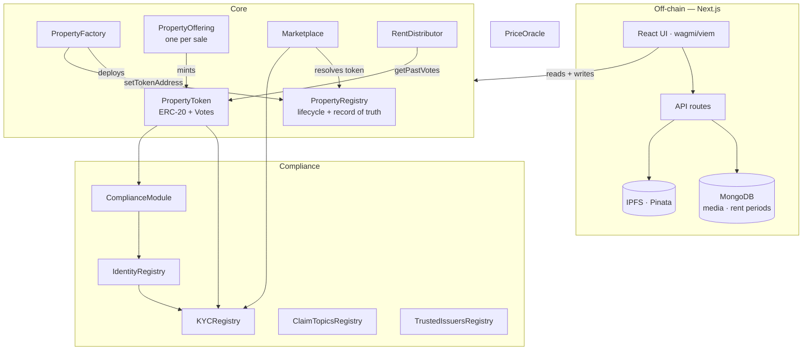

### Contracts

| Contract | Role | Upgradeable |
|---|---|---|
| `PropertyRegistry` | Every property record + the lifecycle state machine | UUPS |
| `PropertyFactory` | Deploys one `PropertyToken` per property, writes it back to the registry | UUPS |
| `PropertyToken` | ERC-20 + Permit + Votes. Transfers gated on KYC; **auto-delegates every holder to self** so vote checkpoints track balances | — |
| `PropertyOffering` | Primary sale escrow for one property. Investors deposit, admin finalises, investors pull tokens | — |
| `Marketplace` | Secondary listings, protocol fee in bps, both sides KYC-checked | UUPS |
| `RentDistributor` | Merkle-proof rent claims with an on-chain pro-rata cap | UUPS |
| `KYCRegistry` | Verification, expiry, sanctions freeze. `KYCRegistryDemo` adds `selfVerify()` for testnet | UUPS |
| `ComplianceModule` | Per-token rules: max holders, max per wallet, country allow/block | — |
| `IdentityRegistry` / `ClaimTopicsRegistry` / `TrustedIssuersRegistry` | ERC-3643-style identity + claim plumbing | — |
| `PriceOracle` | Pushed USD valuations with a staleness check | UUPS |

### Roles

`PROPERTY_ADMIN_ROLE` lifecycle & registry writes · `FACTORY_ROLE` token deployment · `MINTER_ROLE` minting (held by the offering) · `VERIFIER_ROLE` KYC attestations · `COMPLIANCE_ADMIN_ROLE` rule sets · `ADMIN_ROLE` fees, pausing, reclaim · `UPDATER_ROLE` oracle prices · `PAUSER_ROLE` emergency stop

### Deployed — Sepolia

| Contract | Address |
|---|---|
| PropertyRegistry | `0x7423cB7FFfb67d7BD5b2A07c6648754C37784d8a` |
| PropertyFactory | `0x689aF9F42f1A66F400075bD6Bb2f59999FadD507` |
| Marketplace | `0xB50725990C357CBdE31B627b6eBf3728E0A3a880` |
| RentDistributor | `0x61F297dd02fa4b89b2d9f75A27A452d735880b52` |
| KYCRegistry | `0x6bbE2D854848f619C0D261331B8d022FC0480048` |
| PriceOracle | `0x62F4dfb7A5a4ED465aF02E03A640B23189938427` |
| Payment token | `0x1c7D4B196Cb0C7B01d743Fbc6116a902379C7238` (USDC) |

---

## Property lifecycle

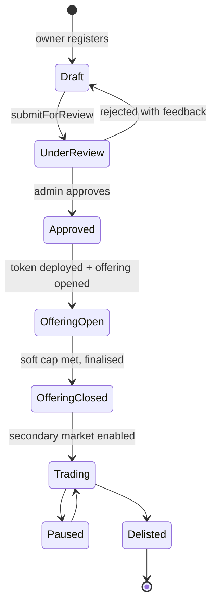

Nothing is investable until an admin approves it, and a token cannot be minted before the offering that mints it exists.

---

## Walkthrough

### Browse and inspect

Every asset in the registry, with live offering status and price per token.

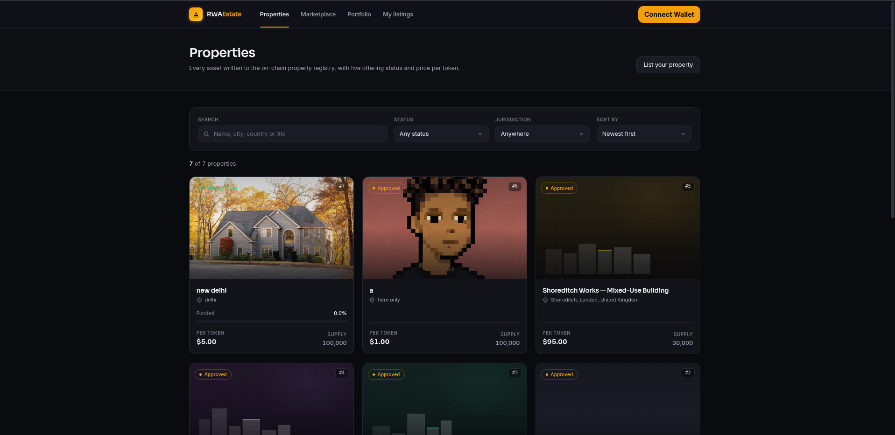

The detail page reads straight from chain — owner, token contract, offering contract, SPV, legal-pack hash — and links the IPFS metadata CID with a gateway fallback list.

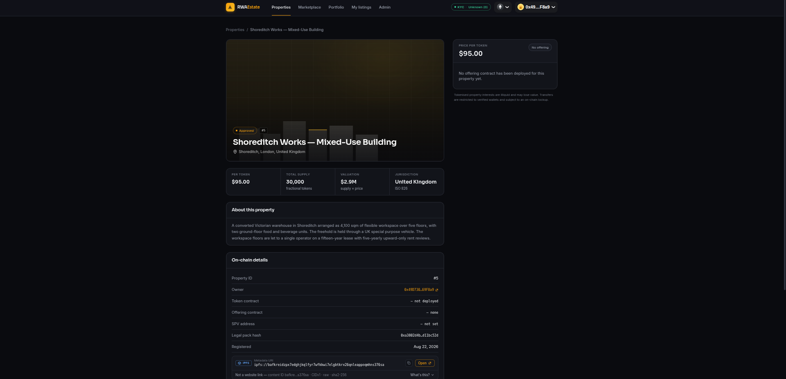

### List a property

A four-step wizard: property → tokenisation → legal → review. Photos and metadata are pinned to IPFS first, then `registerProperty` writes the CID on-chain as a **Draft**.

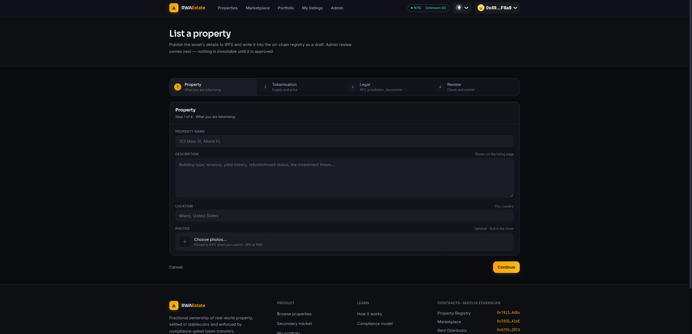

### Admin · registry

Each row shows the single next lifecycle transition available. `Deploy token` calls the factory, `Mint` issues supply, `Open offering` deploys the sale contract, grants it `MINTER_ROLE`, and flips the property to `OfferingOpen` — three transactions, reported step by step.

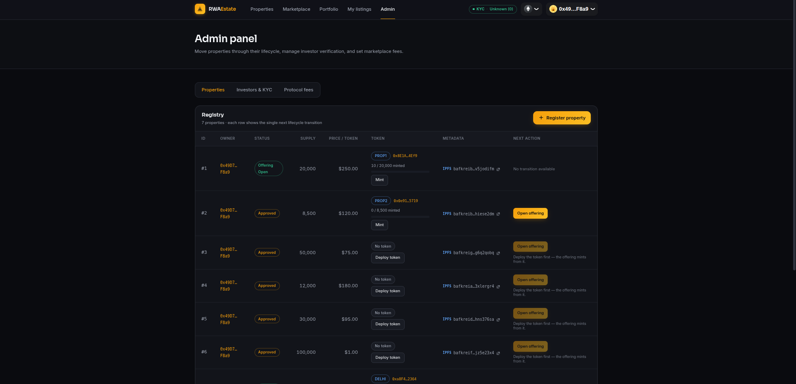

### Admin · investors & KYC

Verification writes the wallet into the KYC registry with country, investor type and expiry. Until it lands, the compliance module rejects every transfer to that address. Freezing blocks transfers and rent claims immediately; revoking removes the record.

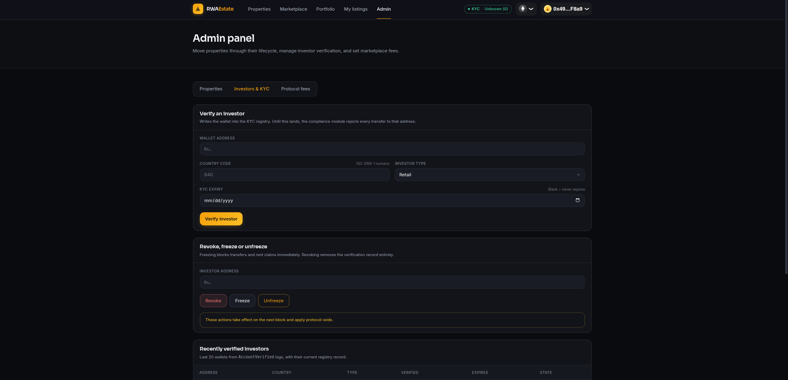

### Admin · rent distribution

Pick a property, a rent amount and a past snapshot block. The server rebuilds the holder set from that block and previews the allocation before anything is signed.

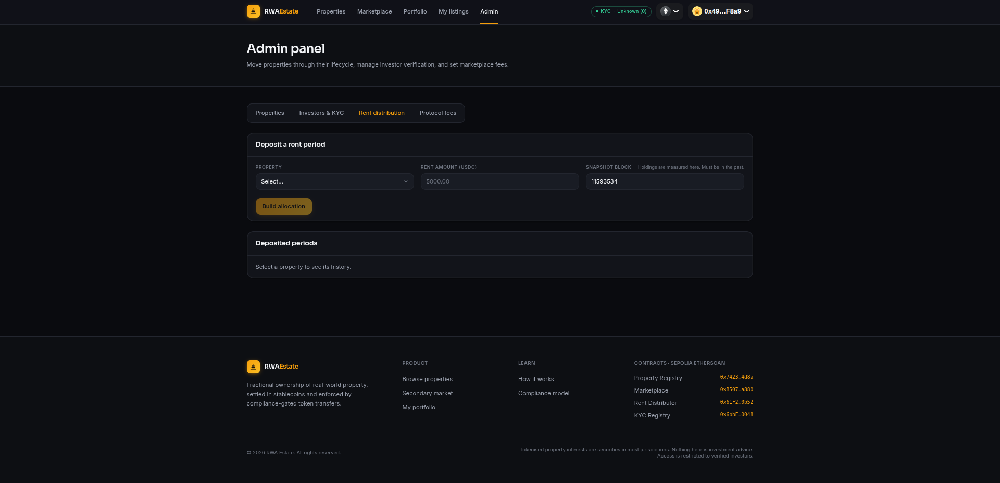

### Admin · protocol fees

Marketplace fee in basis points (max 1000) and the collector address. Both apply to every subsequent settlement.

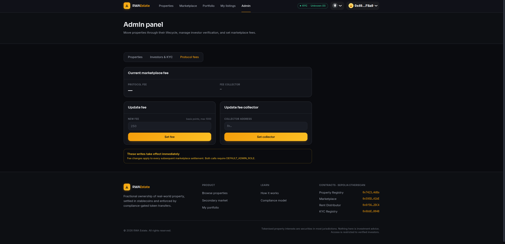

### Secondary market

Listings settle only between wallets that pass the on-chain compliance check. Sellers escrow their tokens in the marketplace; buyers pay in USDC, with cost rounded up so dust is never free.

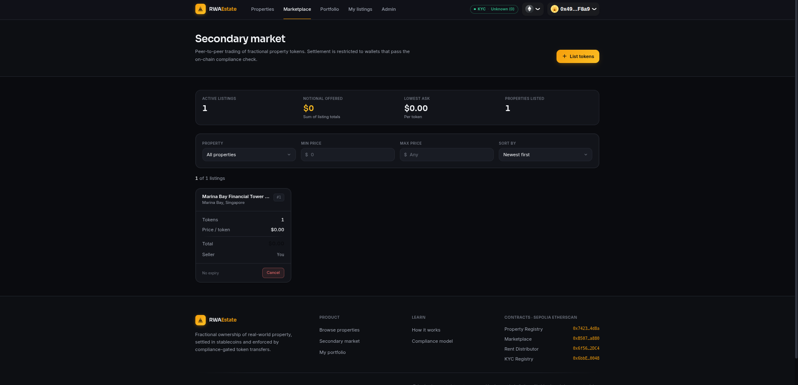

### Portfolio

Positions, lockups and claimable rent, all read directly from the token and distributor contracts.

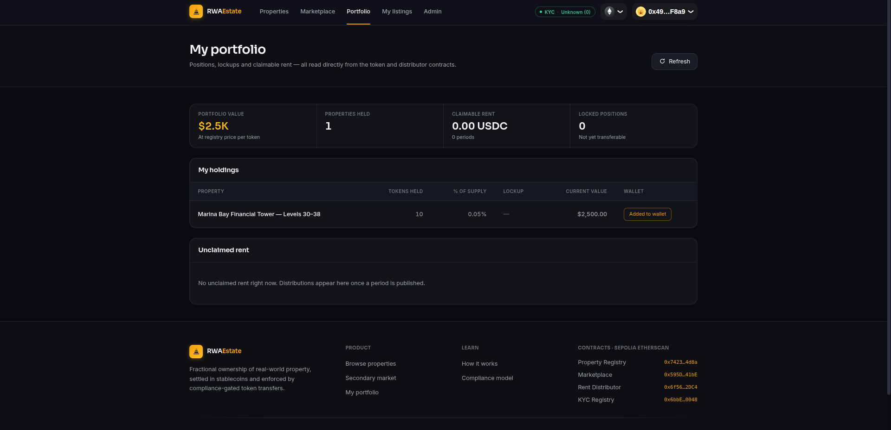

---

## How rent distribution works

The interesting part. Balances are not read live — they come from ERC20Votes checkpoints at a chosen past block, so nobody can buy in after a deposit and dilute the existing holders.

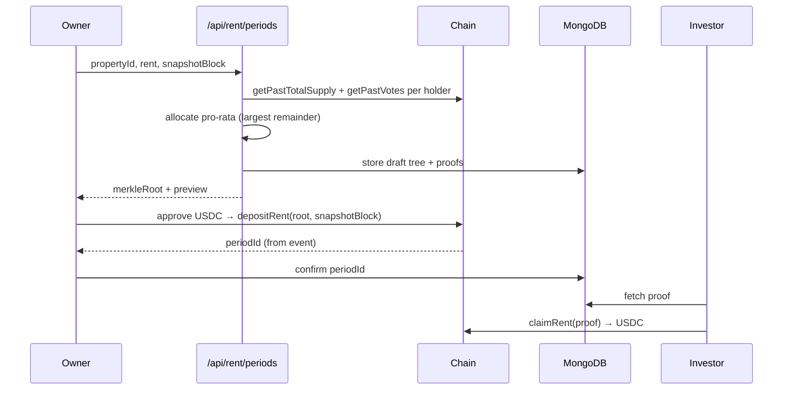

Three invariants hold this together:

1. **The snapshot is mandatory.** `depositRent` rejects a zero block, a future block, or one with no checkpoint on the token.
2. **The chain caps every claim** at `ceil(pastVotes × totalRent / pastTotalSupply)` — a wrong off-chain tree can under-pay but never over-pay.
3. **The allocator must use largest-remainder rounding.** Dumping truncation dust on one holder pushes them past their cap and their claim reverts.

Tokens held by contracts that cannot call `claimRent` — the marketplace escrow, mainly — are deliberately left out of the tree. That share stays unallocated and is sweepable by an admin after the 90-day reclaim window.

---

## Off-chain services

| Piece | Why it exists |
|---|---|
| **IPFS / Pinata** | Property metadata, photos and legal documents. Only the CID goes on-chain |
| **MongoDB** | Merkle claim sets keyed by `(chainId, propertyId, periodId)`, plus a media index that bridges the window between pinning a file and knowing its property id |
| **Next.js API routes** | Build snapshots and Merkle trees server-side; serve proofs to investors |
| **Chunked log scanning** | Hosted RPCs cap `eth_getLogs` at ~10k blocks, so every scan is split and retried |

---

## Layout

```
src/
  core/        PropertyRegistry, Factory, Token, Offering, Marketplace, RentDistributor
  compliance/  KYCRegistry(+Demo), ComplianceModule, Identity/ClaimTopics/TrustedIssuers
  oracles/     PriceOracle
  utils/       Types, Errors, Events
script/        Foundry deploy + upgrade scripts
test/unit/     396 tests
frontend/
  app/         Next.js routes + API
  lib/
    contracts/ ABIs, addresses, deploy blocks
    hooks/     one hook per user-facing flow
    merkle/    allocator, tree builder, proof fetch
    server/    RPC client, holder snapshot
    db/        MongoDB collections
```

---

## Running it

**Contracts**

```bash
forge install
forge build
forge test
```

**Deploy** — governance first, then core (`make` reads `.env`):

```bash
make deploy-governance   # copy TimelockController into TIMELOCK_ADDRESS
make deploy-core
```

**Frontend**

```bash
cd frontend
npm install
npm run dev
```

`frontend/.env.local` needs:

```
NEXT_PUBLIC_WALLETCONNECT_PROJECT_ID=
NEXT_PUBLIC_SEPOLIA_RPC_URL=
SEPOLIA_RPC_URL=            # server-side; snapshot scans are RPC-heavy
PINATA_JWT=
MONGODB_URI=
MONGODB_DB=
```

> Give the server its own `SEPOLIA_RPC_URL`. A holder snapshot issues dozens of `eth_getLogs` calls, and free-tier providers rate-limit that hard if it shares a key with the browser.

---

## Tests

```bash
forge test --summary
```

396 unit tests, all passing — heaviest coverage on `PropertyOffering` (59), `PropertyRegistry` (56), `KYCRegistry` (44), `Marketplace` (42), `RentDistributor` (40).

---

## Notes and limitations

- **Sepolia only.** `KYCRegistryDemo` lets any wallet self-verify; it must be upgraded back to `KYCRegistry` before anything real.
- **No ComplianceModule is deployed** in the current testnet setup — `PropertyToken` treats the zero address as "no enforcement" and skips it.
- **The marketplace contract must itself be KYC-verified**, or escrowing tokens into it fails the transfer check.
- **Tokens minted before the auto-delegation fix have no voting power**; their holders must call `delegate(self)` once before a snapshot can see them.
- Tokenised property interests are securities in most jurisdictions. Nothing here is investment advice.
